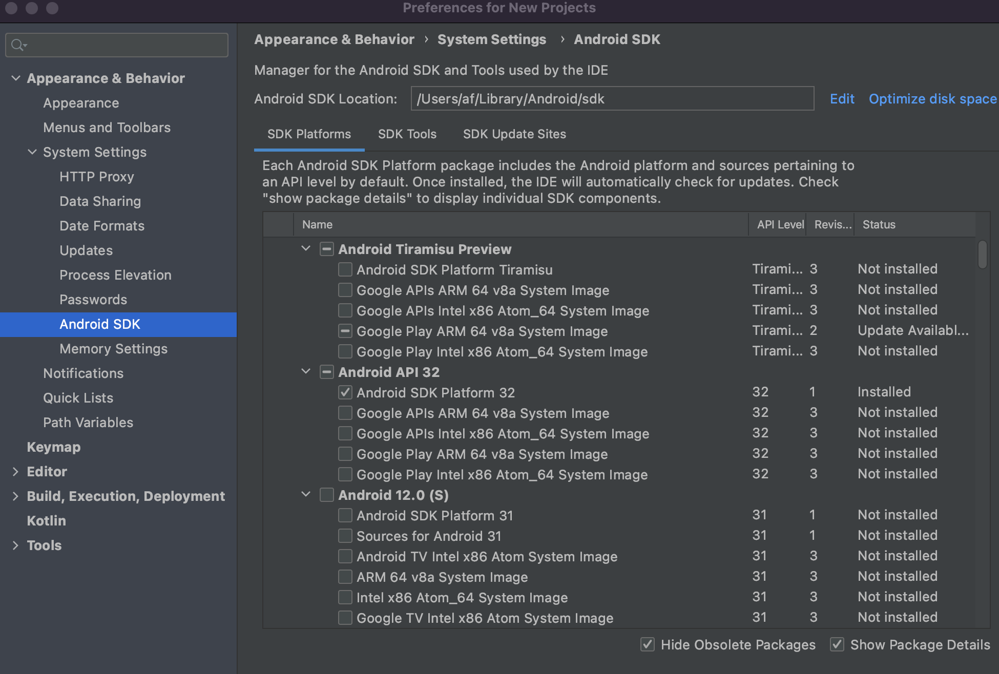

# Android

:::warning Legacy

Getting started the **legacy** Android app done in .NET MAUI.

:::

## Requirements

Before you start, you should have the recommended [Tools and Libraries](../../../tools/index.md)
installed. You will also need to install:

1.  Visual Studio 2022 / VS Code
2.  [.NET 8 (latest)](https://dotnet.microsoft.com/en-us/download/dotnet/8.0)
    - Note: Even if you have an ARM64 based Mac (M1, M2, M3, etc.), you can install all x64 SDKs to
      run Android
    - On Visual Studio for Mac you may need to turn on the feature for .NET 8 by going to Visual
      Studio > Preferences > Preview Features > Use the .NET 8 SDK
3.  .NET MAUI Workload
    - You can install this by running `dotnet workload install maui`
4.  Android SDK 34
    - You can use the SDK manager in [Visual Studio][xamarin-vs], or [Android
      Studio][android-studio] to install this

To make sure you have the Android SDK and Emulator installed:

1.  Open Visual Studio
2.  Click Tools > SDK Manager (under the Android subheading)
3.  Click the Tools tab
4.  Make sure the following items are installed:

    - Android SDK tools (at least one version of the command-line tools)
    - Android SDK Platform-Tools
    - Android SDK Build Tools (at least one version)
    - Android Emulator

5.  Click Apply Changes if you've marked anything for installation

If you've missed anything, Visual Studio should prompt you anyway.

## Android Development Setup

To set up a new virtual Android device for debugging:

1.  Click Tools > Device Manager (under the Android subheading)
2.  Click New Device
3.  Set up the device you want to emulate - you can just choose the Base Device and leave the
    default settings if you're unsure
4.  Visual Studio will then download the image for that device. The download progress is shown in
    the progress in the Android Device Manager dialog.
5.  Once this has completed, the emulated Android device will be available as a build target under
    App > Debug > (name of device)

### ARM64 Macs

1.  Install and open Android Studio
2.  In the top navbar, click on Android Studio > Settings > Appearance & Behavior (tab) > System
    Settings > Android SDK
3.  In the SDK Platforms tab, ensure the "Show Package Details" checkbox is checked (located in the
    bottom-right)
4.  Bellow each Android API you'll see several System Images, pick one of the `ARM 64 v8a` and wait
    for it to download
5.  Go to View > Tool Windows > Device Manager
6.  Inside Device Manager, create a device using the previously downloaded system image



## F-Droid

On `App.csproj` and `Core.csproj` we can now pass `/p:CustomConstants=FDROID` when
building/releasing so that the `FDROID` constant is added to the defined ones at the project level
and we can use that with precompiler directives, e.g.:

```c#
#if FDROID
    // perform operation only for FDROID.
#endif
```

## Building

There are currently a few problems on Visual Studio for Mac for building correctly the projects, so
if you encounter some errors build using the CLI (previously removing bin/obj folders):

```
dotnet build -f net8.0-android -c Debug
```

## Testing and Debugging

### Using the Android Emulator

In order to access `localhost:<port>` resources in the Android Emulator when debugging using Visual
Studio on your Mac natively, you'll need to configure the endpoint addresses using
`<http://10.0.2.2:<port>`\> in order to access `localhost`, which maps the Android proxy by design.

[xamarin-vs]: https://learn.microsoft.com/en-us/xamarin/android/get-started/installation/android-sdk
[android-studio]: https://developer.android.com/studio/releases/platforms

### Using Server Tunneling

Instead of configuring your device or emulator, you can instead use a
[proxy tunnel to your local server](../../../server/tunnel.md) and have your app connect to it
directly.

### Push Notifications

The default configuration for the Android app is to register itself to the same environment as
Bitwarden's QA Cloud. This means that if you try to debug the app using the production endpoints you
won't be able to receive Live Sync updates or Passwordless login requests.

<Bitwarden>

So, in order to receive notifications while debugging, you have two options:

- Use QA Cloud endpoints for the Api and Identity, or
- Use a local server setup where the Api is connected to QA Azure Notification Hub

</Bitwarden>

### Testing Passwordless Locally

Before you can start testing and debugging passwordless logins, make sure your local server setup is
running correctly ([server setup](../../../server/guide.md)). You should also be able to deploy your
Android app to your device or emulator.

:::note

Debugging and testing passwordless authentication is limited by
[push notifications](#push-notifications).

:::

Testing passwordless notifications:

1. Start your local server (`Api`, `Identity`, `Notifications`)
2. Make sure your mobile device can [connect to your local server](#using-server-tunneling)
3. [Start the web client](../../../clients/web-vault/index.mdx), as you will need it to make login
   requests
4. Deploy the Android app to your device or emulator
5. After deployment, open the app, login to your QA account and activate passwordless login requests
   in settings
6. Open the web vault using your preferred browser (ex: http://localhost:8080)
7. Enter the email address of an account that has previously authenticated on that device (i.e. is a
   "known device") and click Continue. When presented with the login options, click click Login with
   Device.
8. Check mobile device for the notification

<Bitwarden>

## AndroidX Credentials

Currently, the
[androidx.credentials](https://developer.android.com/jetpack/androidx/releases/credentials) official
binding has some bugs and we cannot use it yet. Because of this, we made a binding ourselves which
is located in here:
[Xamarin.AndroidX.Credentials](https://github.com/bitwarden/xamarin.androidx.credentials).

As of today, we are using version 1.2.0.

In the projects, the package is added as a local NuGet package located in
`lib/android/Xamarin.AndroidX.Credentials` and this source is already configured in the
`nuget.config` file.

In the case a change is needed on the binding, create a new local NuGet package and replace it in
the aforementioned source.

:::warning

Do not add the project to the solution and as a project reference to the `App.csproj` /
`Core.csproj` this will strangely make the iOS app crash on start because of solution configuration.
Even though we couldn't find the root cause, this is the effect caused by this action.

:::

</Bitwarden>
