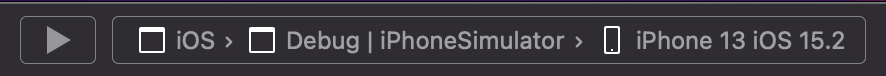
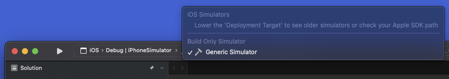
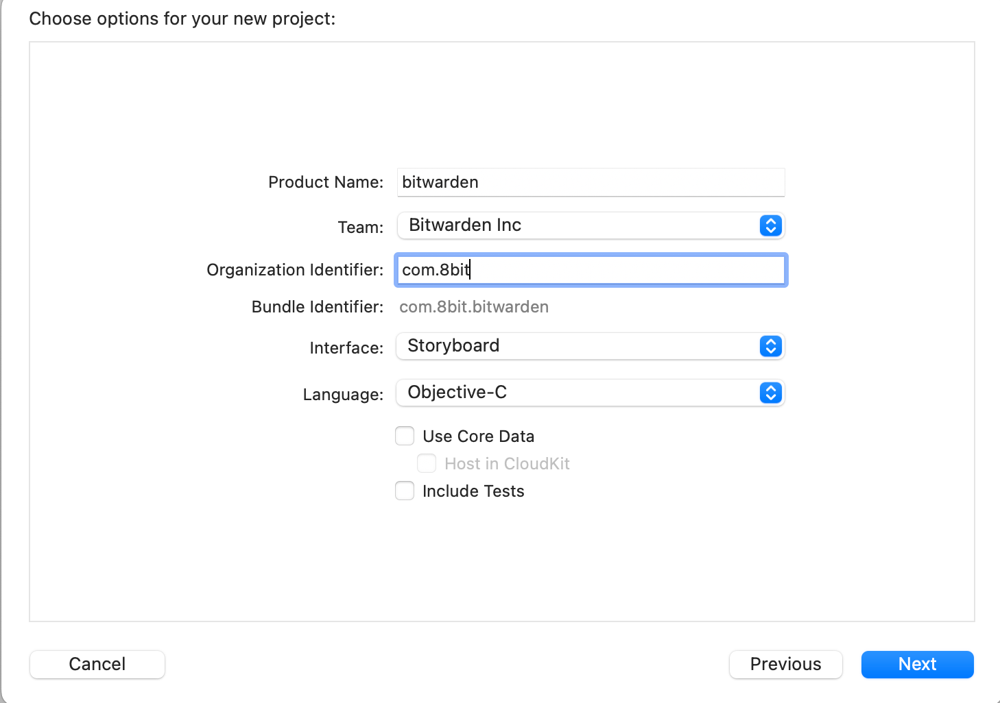
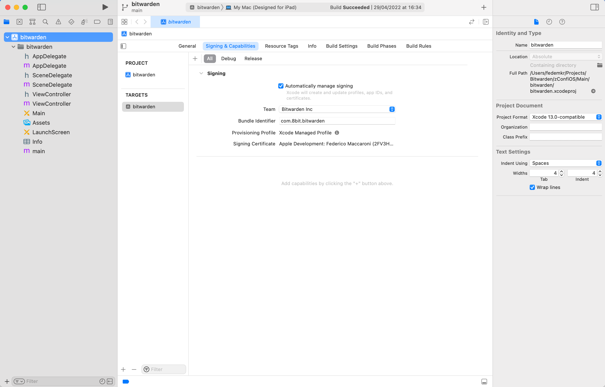

---
sidebar_custom_props:
  access: bitwarden
---

import Tabs from "@theme/Tabs";
import TabItem from "@theme/TabItem";

# iOS

:::warning Legacy

Getting started the **legacy** iOS app done in .NET MAUI.

:::

## Requirements

1.  Visual Studio 2022 / VS Code
2.  [.NET 8 (latest)](https://dotnet.microsoft.com/en-us/download/dotnet/8.0)
    - On Visual Studio for Mac you may need to turn on the feature for .NET 8 by going to Visual
      Studio > Preferences > Preview Features > Use the .NET 8 SDK
3.  .NET MAUI Workload
    - You can install this by running `dotnet workload install maui`
4.  A Mac with Xcode 15.0 installed

## Apple Developer Account Setup

1. Accept your invite to the Bitwarden Apple Developer team. You should get a request in your email
   with the subject "You're invited to join a development team." Click the link, "Accept Invitation"
   and you'll be prompted to create an Apple ID for your Bitwarden email address. If you didn't
   receive this email, contact the IT department (@IT in slack). Accept the terms and conditions and
   complete the sign up flow

2. Go to [Apple ID Online](https://appleid.apple.com/) and log in with your new Apple ID. Set up
   2-factor authentication (using mobile phone and/or trusted device) - this is critical because
   Apple no longer allows "developer" accounts without MFA, but it won't tell you that when your
   build fails locally

3. Go to [App Store Connect](https://appstoreconnect.apple.com/) and accept the terms and conditions

4. Ensure you have access to the Bitwarden team and team app profiles

5. Go to [Apple Developer Account](https://developer.apple.com/account/) and go to the
   "Certificates, IDs & Profiles" menu item. Check that you can see the 8bit Solutions LLC
   Certificates in the Certificates section, and the Bitwarden profiles in the Profiles section. If
   any of this is missing, ask the IT department (@IT #tech-support in slack) for the additional
   roles / permissions

## macOS Setup

Next, you need to get your Mac environment set up for building and running the Bitwarden iOS mobile
project. This requires creating the necessary developer provisioning profiles for code signing and
execution on your Mac through Xcode. Visual Studio has a simple process to get all of the
provisioning profiles, however this is prone to fail without much feedback. Try the Visual Studio
instructions ("The Easy Way") first, and fallback to the Xcode instructions (“The Hard Way”) if
required.

### Visual Studio: The Easy Way

1.  Open Visual Studio for Mac

2.  Go to Preferences > Publishing > Apple Developer Accounts

3.  Click “Add”, choose "Enterprise Account", and sign in with your previously configured Apple
    Developer account

    :::note

    If you receive a "Failed to synchronize with Apple Developer Portal" error, you’re missing
    additional roles / permissions.

    :::

    After signing in successfully, you should see your account in the list and “Bitwarden Inc” in
    the account teams list

4.  Click “View Details…”

5.  If you don’t have a valid Apple Development certificate, click Create certificate > Apple
    Development

6.  Click “Download All Profiles”

7.  You should now be able to run the app by setting
    `iOS > Debug | iPhone Simulator > [pick any iOS Simulator]` in the top left corner and pressing
    Play

    

If this worked, you can skip the next section.

If you only have the option "Generic Simulator", with a message to lower the 'Deployment Target',
your version of MAUI may not yet support the version of Xcode that you are using (as discussed
[here](https://github.com/xamarin/xamarin-macios/issues/15954#issuecomment-1246025735)).



To work around this issue, try [downloading](https://developer.apple.com/download/all/) and
installing an older version of Xcode from Apple (you can look for guidance on which Xcode version to
use from the Xamarin.iOS [release notes](https://github.com/xamarin/xamarin-macios/releases) (this
applies to MAUI as well). After installing the new version of Xcode, restart Visual Studio and load
your project to verify your available simulator options.

:::note

If you need multiple versions of Xcode installed on your development machine, you can rename the
`Xcode.app` file extracted from your download to something else (e.g. "Xcode_14_2.app") before
placing it in your Applications folder. You can then switch between Xcode versions by using
`xcode-select` from the command line. e.g.:

```shell
sudo xcode-select -s /Applications/Xcode_14_2.app
```

You may achieve similar results with tooling such as
[Xcodes.app](https://github.com/XcodesOrg/XcodesApp)

:::

### Xcode: The Hard Way

:::note

If you're the next person to follow these instructions, please commit and upload the Xcode project
files you create so we can streamline this process.

:::

Only try these instructions if the Visual Studio instructions above didn't work for you.

1.  Open Xcode

2.  Accept any defaults, ensure any extensions/add-ons have been installed, etc.

3.  Create new project... > iOS > App

4.  Use the following options for your new project:

    - Product Name: "bitwarden"

    - Team: Bitwarden Inc (if this is missing, double check your Apple Developer Account setup
      above)

    - Organization Identifier: "com.8bit"

    - Bundle Identifier (automatically generated): "com.8bit.bitwarden"

    - Language: Objective-C

    - User Interface: Storyboard

    - Leave all other checkboxes unchecked (or uncheck them)

    

5.  Click Next, save to the default location and then click "Create"

6.  On the project configuration page, click the "Signing & Capabilities" tab

7.  Make sure you have the following defaults:

    - Automatically manage signing: (checked)

    - Team: Bitwarden Inc

    - Provisioning Profile: Xcode Managed Profile

    - Signing Certificate: your Apple ID/Name

    

8.  From the menu bar, click Product > Build

9.  Repeat Steps 3-8, with the following changes in step 4:

    - Product Name: "find-login-action-extension"

    - Organization Identifier: "com.8bit.bitwarden"

    - Bundle Identifier (automatically generated): "com.8bit.bitwarden.find-login-action-extension"

10. Repeat Steps 3-8, with the following changes in step 4:

    - Product Name: "autofill"

    - Organization Identifier: "com.8bit.bitwarden"

    - Bundle Identifier (automatically generated): "com.8bit.bitwarden.autofill"

11. Repeat Steps 3-8, with the following changes in step 4:

    - Product Name: "share-extension"

    - Organization Identifier: "com.8bit.bitwarden"

    - Bundle Identifier (automatically generated): "com.8bit.bitwarden.share-extension"

12. If you have a physical device (e.g. iPhone or iPad) that you want to use for testing, you will
    also need to do the following for each of the Xcode projects you just created:

    - connect the device with a cable

    - select your device as as the build target in Xcode

    - from the menu bar, click Product > Build

    - agree to register your device if asked

    :::note

    Sometimes these profiles can mess up. If you have issues running on your physical device (or
    simulator) try running `rm -r ~/Library/MobileDevice/Provisioning\ Profiles` to clear them out.
    Build each Xcode project again to regenerate them.

    :::

## Visual Studio

Next, we need to configure your Visual Studio environment for development.

<Tabs groupId="os">
<TabItem value="win" label="Windows" default>

1. Connect to the Mac that you just completed the above steps on

2. Open Visual Studio and click Tools > iOS > Pair to Mac

3. Scan for and select your machine. If you don't see it, click the "Add Mac..." button and put in
   the Mac name or IP address. If you don't know your Mac name (or you're in a Windows VM on your
   Mac), go to your Mac and open System Preferences > Sharing and look for the ".local" address of
   your machine

4. Provide your Username and Password for macOS when prompted

5. Once paired, close the Pair Mac window

6. Change your active build profile to Debug > iPhoneSimulator > iOS

7. Rebuild the iOS project from Solution Explorer

8. You can now debug using the iOS Simulator

</TabItem>
<TabItem value="mac" label="macOS">

1. Check that command line tools are installed:

   1. Open Xcode

   2. From the menu bar, click Xcode > Preferences > Locations

   3. Make sure an Xcode version is selected under "Command Line Tools"

2. Open Visual Studio for Mac

3. Open the mobile solution file (`bitwarden-mobile.sln`) in the root of your local mobile
   repository

4. In the top bar, you should be able to select App > Debug > select your model and click run (or
   your physical device if you set one up)

</TabItem>
</Tabs>

## Building

To build from the CLI, navigate to the application directory:

For device:

```
cd src/App
dotnet build -f net8.0-ios -c Debug -r ios-arm64
```

For simulator:

```
cd src/App
dotnet build -f net8.0-ios -c Debug -r iossimulator-x64
```

You can also use the IDE but keep in mind:

:::tip Visual Studio for Mac

There are currently a few problems on Visual Studio for Mac for building correctly the projects, so
if you encounter some errors, build using the CLI being into the `src/App` folder (previously
removing bin/obj folders).

:::

:::tip Argon2Id

If you find any errors regarding argon2Id library when building for simulator, please be sure that
you are building for runtime identifier `iossimulator-x64` as currently the library doesn't support
`iossimulator-arm64`.

:::

:::tip Troubleshooting common mistakes

If you find the next error:

> `error NETSDK1134`: Building a solution with a specific RuntimeIdentifier is not supported. If you
> would like to publish for a single RID, specify the RID at the individual project level instead

you almost surely are trying to build the app from the root folder. Instead go to `src/App` and try
building again.

:::

### Argon2Id library loading

The Argon2Id library (`libargon2.a`) is loaded using `MTouchExtraArgs` in almost all projects of the
solution. In order to make this simpler a property was added into **Directory.Build.props** called
`Argon2IdLoadMtouchExtraArgs` which has the code to fill in the extra args parameter. Each project
is configured with this property so this is only added on the correct runtime identifiers and we can
build the app successfully on each case.

### Ignoring extensions / watchOS app

Sometimes we need to quickly build the app or maybe some configuration on the iOS extensions or the
watchOS app gets in the way. In order to have a fast way to only care about the main app two
properties were added to the **Directory.Build.Props** to help with this:

- `IncludeBitwardeniOSExtensions`: If `True` then all the iOS extensions will be included on the
  building of the main app, otherwise they will be skipped.
- `IncludeBitwardenWatchOSApp`: If `True` then the watchOS app will be included on the building of
  the main app, otherwise it will be skipped.

:::warning Shared code

Toggling these off can provide a faster developer experience which is really useful in a lot of
scenarios, but always bear in mind that a lot of things are shared between the main app and the
extensions so before pushing your work, test again with everything enabled just in case.

:::

### Release mode locally

There are some issues that require us to build the app on **Release** configuration but locally
without going through the CI/CD pipeline. The problem is that we don't have the code signing details
for Distribution locally. To overcome this we can use the same `CodesignProvision` and `CodesignKey`
we use for **Debug** but on the **Release** config. The thing is that it's a bit cumbersome to
change that on every project so two properties were added to the **Directory.Build.Props** to help
with this:

- `ReleaseCodesignProvision`: `CodesignProvision` for Release config on all projects
- `ReleaseCodesignKey`: `CodesignKey` for Release config on all projects

By replacing their values, all projects will have their values applied so it's easier to build the
app in **Release** mode locally.

## Debugging

### iPhone Simulator

The iPhone Simulator has access to localhost and you can point the client at your local dev server
as usual. However, the app will require https by default. To allow http for testing purposes, follow
these steps.

1. Open `src/App/Platforms/iOS/Info.plist` in Visual Studio Code or another editor so that you can
   edit the raw XML. (Don't use the Property List Editor in Visual Studio.)

2. Add the following code in the top-level `<dict>` element:

   ```xml
   <key>NSAppTransportSecurity</key>
   <dict>
       <key>NSAllowsArbitraryLoads</key>
       <false/>
       <key>NSExceptionDomains</key>
       <dict>
           <key>localhost</key>
           <dict>
               <key>NSExceptionAllowsInsecureHTTPLoads</key>
               <true/>
               <key>NSIncludesSubdomains</key>
               <true/>
           </dict>
       </dict>
   </dict>
   ```

3. Save and exit `Info.plist`

4. Press <kbd>Command</kbd> + <kbd>B</kbd> to force a new build before launching

5. Don't push these changes :)

### iPhone device

The device doesn’t have direct access to your Mac’s localhost, so you can follow
[this guide to connect them](https://ymoondhra.medium.com/how-to-run-localhost-on-your-iphone-4110a54d1896).

After you do that, you’ll have to also modify the `Info.plist` to allow http for testing purposes as
explained before on the simulator testing.

It’s also highly likely that you need to change the `launchSettings.json` on Server, on `Properties`
of each project. There you need to change the `applicationUrl` of `iisSettings -> iisExpress` and of
`profiles -> Identify` so that instead of `localhost` it says `name.local` where `name` is the
computer name you set on Mac’s Sharing config.

Before you actually test on the app, open a browser and try to connect to the `Api` by going to
`http://name.local:4000/alive` . If this doesn’t work then review the steps on the guide or the
server configuration. Make sure you have your `User secrets` up to date as well.

Finally, you’ll have to configure the `Api` and `Identity` urls on the phone to use
`http://name.local:4000` and `http://name.local:33656` where `name` is the computer name you set on
Mac’s Sharing config.

### iOS Extensions

1. Set the iOS Extension project as Startup project

2. Press Run

3. You will receive a popup saying "Waiting for the debugger to connect..."

4. Don’t open the Bitwarden app (otherwise the debugger will connect to it instead of the
   extension). Instead trigger the extension

5. Your extension breakpoints should now be hit

For example: if you want to debug the **iOS.Autofill** extension, you would complete steps 1 - 3,
then go to your iOS device, open a browser, go to a login, tap the key icon and open Bitwarden from
the bottom popup.

### Using Server Tunneling

Instead of configuring your device or emulator to ignore SSL certificates, you can instead use a
[proxy tunnel to your local server](../../../server/tunnel.md) and have your app connect to it
directly.

### Push Notifications (Live Sync & Passwordless)

Push notifications are not currently available for debug deployments. They are only supported on
TestFlight and production builds.
